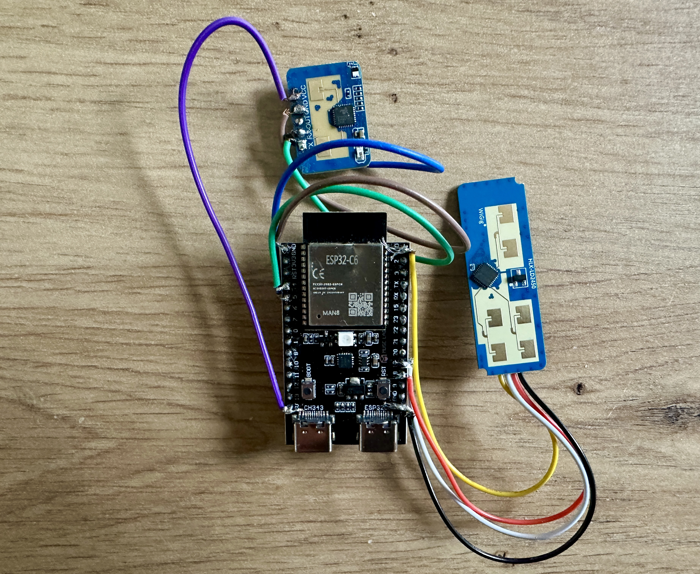
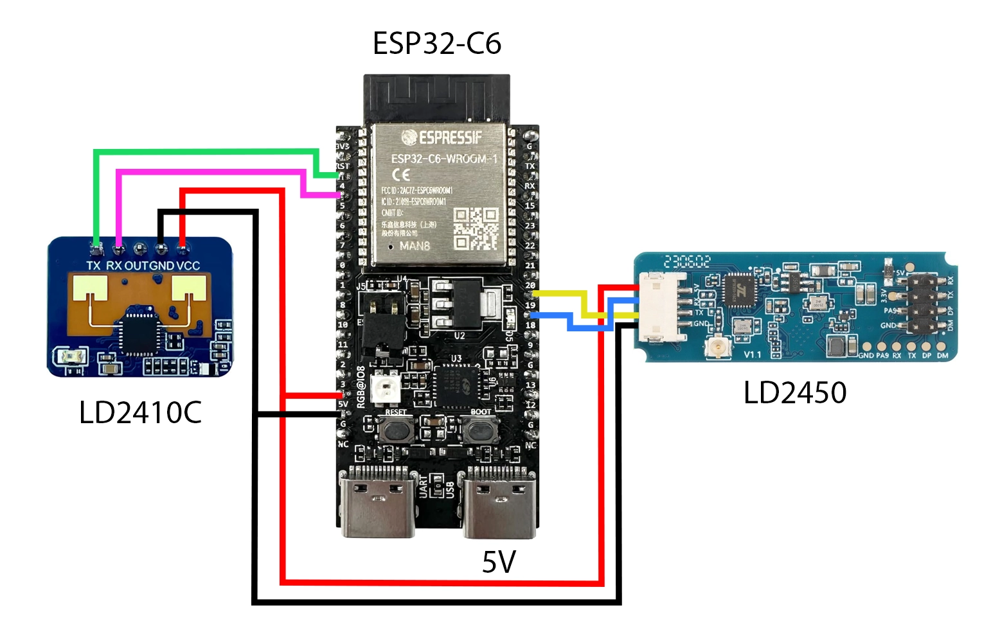

# SHS-Z2M-Presence

**Dual mmWave Presence Sensor Firmware for ESP32-C6 with Zigbee2MQTT Support**



---

## Overview

This project is a continuation of the original [**Smart Home Scene** DIY Zigbee mmWave presence sensor](https://smarthomescene.com/guides/diy-zigbee-mmwave-presence-sensor-with-esp32-c6-and-ld2410/) made for the ESP32-C6 + LD2410. This enhanced firmware now supports the **LD2450** sensor for **multi-zone detection** and **multi-target tracking** (up to 3 simultaneous targets).

The sensor is fully compatible with **Zigbee2MQTT** and works seamlessly with Home Assistant.

### Companion Home Assistant Add-on


For the best experience, install the **SHS Z2M Presence Zone Configurator** add-on for Home Assistant. It allows you to:

- Create rooms with custom floor plans
- Add furniture and obstacles to your map
- Draw and configure detection zones visually
- Set up interference zones to filter false positives
- Real-time target tracking visualization

**[SHS Z2M Presence Zones Add-on →](https://github.com/notownblues/SHS-Z2M-Presence-Zones)**

---

## Hardware Requirements

| Component | Purpose |
|-----------|---------|
| ESP32-C6 | Zigbee-enabled microcontroller |
| LD2410C | Presence detection (moving/static) |
| LD2450 | Multi-target position tracking & zones |

---

## Wiring



### LD2410C
- TX (LD2410C) → GPIO4 (RX1) on ESP32-C6
- RX (LD2410C) → GPIO5 (TX1) on ESP32-C6
- VCC → 5V
- GND → GND

### LD2450
- TX (LD2450) → GPIO19 (RX0) on ESP32-C6
- RX (LD2450) → GPIO18 (TX0) on ESP32-C6
- VCC → 5V
- GND → GND

> **Note:** Some ESP32-C6 boards have 2 x 5V pins and some have one. Both sensors can share the same 5V pin or use separate ones if available.

---

## Features

- **Dual Sensor Cross-Validation**: LD2410C and LD2450 work together to reduce false positives
- **Multi-Zone Support**: Up to 5 configurable zones with different operation modes
- **Multi-Target Tracking**: Track up to 3 simultaneous targets with X/Y positions
- **Zone Types**: Detection (inclusion), Filter (exclusion), and Interference (false positive filtering)
- **Zigbee Router Mode**: Stable connection that also extends your Zigbee mesh
- **Persistent Configuration**: Zone settings saved to flash memory

---

## Firmware Flashing

The flashing process is thoroughly documented by Smart Home Scene. Follow the complete tutorial here:

**[DIY Zigbee mmWave Presence Sensor with ESP32-C6 and LD2410 →](https://smarthomescene.com/guides/diy-zigbee-mmwave-presence-sensor-with-esp32-c6-and-ld2410/)**

Once you've flashed the firmware and paired the device with Zigbee2MQTT, continue with the steps below.

---

## Setting Up the Zigbee2MQTT Converter

After pairing your sensor, you need to add the external converter to Zigbee2MQTT for full functionality.

Copy `zigbee2mqtt/external_converters/shs01_enhanced.js` from this repository to your Zigbee2MQTT external converters folder:

**For Home Assistant Add-on:**
```
/homeassistant/zigbee2mqtt/external_converters/shs01_enhanced.js
```

**For Docker/Standalone:**
```
/opt/zigbee2mqtt/data/external_converters/shs01_enhanced.js
```

Restart Zigbee2MQTT for the changes to take effect. Your device should now expose all available entities.

If some or all entities show as "Null" or "N/A", click the "Configure" button straight after pairing to refresh the states.

---

## What the Sensor Exposes

Once properly configured, the sensor exposes the following entities in Zigbee2MQTT:

### Occupancy & Detection

| Entity | Description |
|--------|-------------|
| `occupancy_ld2410` | LD2410C presence detection (moving or static) |
| `occupancy_ld2450` | LD2450 overall presence (based on target count) |
| `moving_target` | Moving target detected by LD2410C |
| `static_target` | Static target detected by LD2410C |
| `ld2450_target_count` | Number of active targets (0-3) |

### Zone Detection

| Entity | Description |
|--------|-------------|
| `zone1_occupied` - `zone5_occupied` | Binary occupancy per zone |
| `zone_1_targets` - `zone_5_targets` | Target count per zone |

### Position Data (Config Mode Only)

| Entity | Description |
|--------|-------------|
| `target1_x`, `target1_y`, `target1_distance` | Target 1 position (mm) |
| `target2_x`, `target2_y`, `target2_distance` | Target 2 position (mm) |
| `target3_x`, `target3_y`, `target3_distance` | Target 3 position (mm) |

### Configuration Options

| Entity | Range | Description |
|--------|-------|-------------|
| `moving_cooldown` | 0-300s | Time before motion clears |
| `occupancy_delay` | 0-300s | Time before occupancy clears |
| `moving_sensitivity` | 0-10 | Moving detection sensitivity |
| `static_sensitivity` | 0-10 | Static detection sensitivity |
| `moving_max_distance` | 0-6m | Maximum moving detection range |
| `static_max_distance` | 1.5-6m | Maximum static detection range |
| `position_reporting` | On/Off | Enable Config Mode |

---

## Config Mode (Position Reporting)

The firmware includes a **Config Mode** that enables real-time position reporting. This mode is essential for configuring zones and visualizing target tracking in the Zone Configurator add-on.

### Activating Config Mode

Config Mode can be activated via:

1. **Zigbee2MQTT**: Toggle the `position_reporting` switch ON
2. **Zone Configurator Add-on**: Click the "Enable Position Reporting" button
3. **Physical Button**: Click the BOOT button **3 times** quickly

To deactivate, use the same methods (toggle OFF, click button, or 3 more clicks).

When Config Mode is activated or deactivated, the onboard LED will toggle to provide visual feedback.

### ⚠️ Important Warnings

> **Use Config Mode only during zone configuration!**

Config Mode streams X/Y coordinates, distances, and target data continuously, generating **significantly more Zigbee traffic** than normal operation.

**Testing Results:**
This mode was tested for 2 weeks during 5-10 minutes at a time on a network with 100+ devices using a ZBDongle-P coordinator and did not cause any network crashes. However, every setup is different. If your network already has "chatty" devices, prolonged use of Config Mode could potentially cause instability.

**Best Practices:**
- Enable Config Mode only while actively configuring zones in the Zone Configurator
- Disable it immediately after completing your configuration
- The sensor works perfectly without Config Mode — zone detection and occupancy function independently

When Config Mode is OFF, the sensor still processes zones locally and reports occupancy states correctly. Only the real-time position streaming is disabled.

---

## Zone Types

The sensor supports 4 zone operation modes:

| Type | Behavior | Use Case |
|------|----------|----------|
| **Off** | Zone disabled | Default state |
| **Detection** | Only detect targets INSIDE zones | Focus on specific areas (bed, desk, couch) |
| **Filter** | Ignore targets INSIDE zones | Exclude areas (doorways, windows with moving curtains) |
| **Interference** | Treat targets as false positives | Filter reflections and sensor artifacts |

---

## Dual Sensor Interference Mitigation

During development and testing, I discovered that the LD2450 was causing interference on the LD2410C. This resulted in false presence triggers every few minutes with sudden energy spikes, even when no one was in the room.

**Solution implemented:** The LD2410C presence is only reported if the LD2450 has also detected at least one target. This cross-validation approach significantly reduces false positives while maintaining reliable detection.

---

## Building from Source

If you want to modify and build the firmware yourself:

```bash
idf.py set-target esp32c6
idf.py build
idf.py flash
```

---

## Credits & Acknowledgments

This project would not have been possible without the excellent work from **[Smart Home Scene](https://smarthomescene.com)**. Their original DIY Zigbee mmWave presence sensor guide and firmware provided the foundation for this enhanced version.

**Original Project:** [DIY Zigbee mmWave Presence Sensor with ESP32-C6 and LD2410](https://smarthomescene.com/guides/diy-zigbee-mmwave-presence-sensor-with-esp32-c6-and-ld2410/)

---

## Contributing

Contributions are welcome! Feel free to:

- **Report issues** or bugs you encounter
- **Submit feature requests** for improvements
- **Create pull requests** with fixes or new features
- **Design enclosure cases** — I would love to see community-designed cases for this sensor!

If you find this project useful, consider giving it a star!

